# Análisis Estadístico sobre la Maratón de Boston
**Integrantes**
  - Álvaro Luis González Brito 
  - Javier Lima García
  - Álbaro Suárez Valdes

**Grupo**: C-312

**Código fuente**: [Boston Marathon Stats](https://github.com/BritoAlv/marathonstatistics)

## Datos utilizados

Dado el prestigio, tradición y participación (más de 25000 personas en 2015 y la cifra va en aumento) de la **Maratón de Boston** (Boston Marathon), decidimos realizar un análisis estadístico sobre los resultados de ediciones anteriores de este evento.

La fuente sobre la que nos apoyamos fue el [Boston Marathon Data Project](https://github.com/adrian3/Boston-Marathon-Data-Project) un repositorio de Github que alberga los resultados de la maratón desde 1897 hasta 2019.

Los datos se encuentran en formato **csv** y ofrecen las siguientes variables:

- `display_name`
- `age`
- `gender`
- `residence`
- `pace`
- `official_time`
- `overall`
- `gender_result`
- `division_result`
- `seconds`
- `first_name`
- `last_name`

Vale recalcar que, de 2015 en adelante fueron añadidos:

- `bib`
- `city`
- `state`
- `5k` 
- `10k`
- `15k`
- `20k`
- `half`
- `25k`
- `30k`
- `35k`
- `40k`

Por motivos pragmáticos decidimos trabajar solamente sobre los datos recopilados en los eventos de **2005**, **2010** y **2015**.

### Informe

La primera pregunta estadística que nos viene a la mente cuando hablamos de competiciones (incluso antes de realizar un análisis exploratorio) es: ¿cómo se comportaron los resultados?, o mejor formulado: ¿qué distribución poseen?


El histograma describe una distribución que se asemeja a una **normal**; lo que nos lleva directamente a plantear y comprobar la hipótesis: `los resultados de la maratón de 2015 tienen una distribución normal`.

Utilizando los tests de **Kolmogorov-Smirnov** y **Shapiro** sobre `muestras aleatorias de 100 y 30 personas` respectivamente obtuvimos los siguientes resultados 


#### 1. Análisis Exploratorio de los Datos

**Primero una vista global de los datos**:

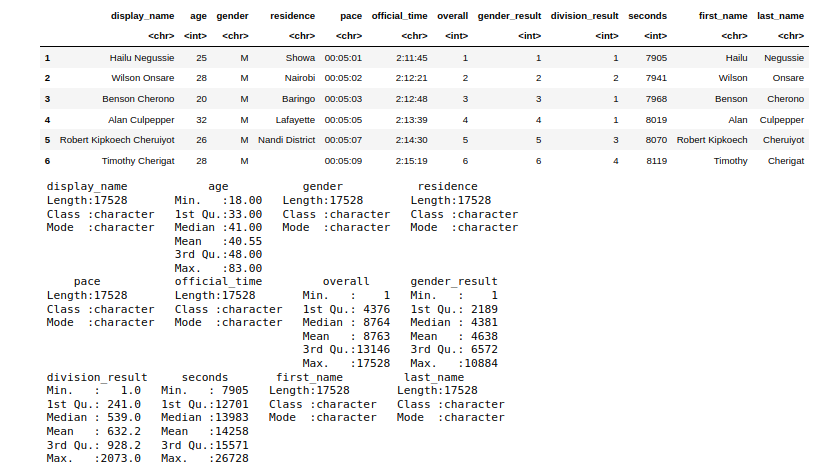

A simple vista podemos ver que los datos parecen correctos, la edad mínima para correr en el maratón es de $18$ años, mientras que la máxima fue de $83$. La media del tiempo necesitado para correr la carrera fue de $14258$ segundos.

**Clasificarlos por los segundos dedicados a realizar la carrera y contrastarlo contra la edad.**
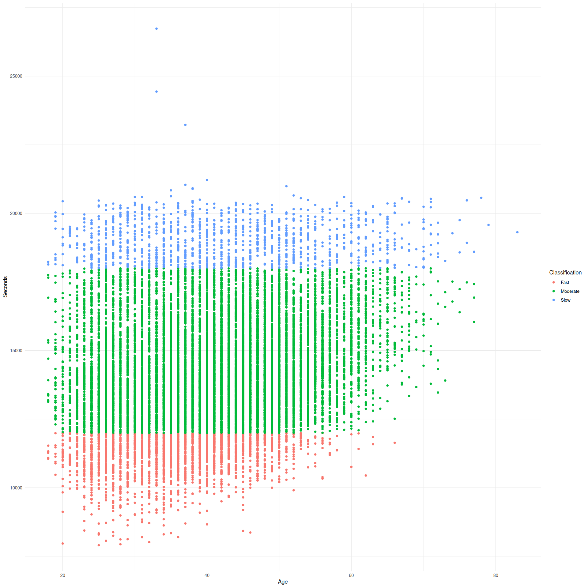

**Dispersión de Lugar vs País de Residencia**


Como podemos observar, los resultados obtenidos en la gráfica coinciden con lo que nos indica el sentido común: países como Etiopía y Kenya obtuvieron lugares muy cercanos al podio, sin embargo, tuvieron una escasa participación en el evento (dado los bajos recursos económicos de sus habitantes), mientras que países como USA, Italia, Francia, UK y Australia sí tuvieron una asistencia prominente (dado que son potencias económicas).

**Dispersión de Lugar vs Edad**


Como en la dispersión anterior, el sentido común nos hubiera ayudado a predecir el resultado obtenido en esta gráfica: las personas relativamente jóvenes (entre 20 y 45 años) ocupan la mayoría de las posiciones cercanas al podio y representan el grueso de la participación; mientras que los mayores de 50 ocupan lugares alejados de la cabecera y su densidad es mucho menor.

**Matriz de Correlación**

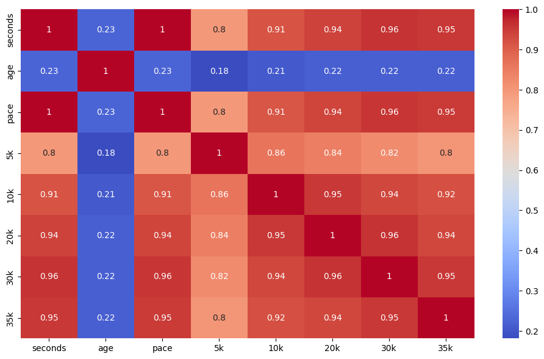

Podemos extraer dos conclusiones importantes de la matriz de correlaciones obtenida. La primera es que el tiempo obtenido durante los primeros 5km no es tan buen predictor del resultado global como el tiempo de los primeros 10km, y la explicación detrás de esto se encuentra en que muchos corredores inexpertos se lanzan, impulsados por el ánimo, ansiedad y ambición, a correr demasiado rápido al comienzo de la carrera, llevándolos a una fatiga que termina en peores resultados globales.

La segunda conclusión es que existe una correlación positiva débil entre la edad y el tiempo total; un resultado un poco contradictorio con lo que nos dicta la intuición, pensaríamos que la correlación es positiva fuerte. La explicación, se encuentra en la biología, a medida que envejecemos las fibras musculares rápidas, encargadas de movimientos de fuerza y potencia, se pierden con mayor rapidez que las fibras lentas, útiles para ejercicios de resistencia como correr; Eliud Kipchoge es el vivo ejemplo, cuando con 40 años fue capaz de bajar de las 2 horas en la maratón (se pensaba que era una marca imposible de conseguir).

#### 2. Preguntas sobre los datos

**2.1 ¿Siguen las edades una distribución normal?**

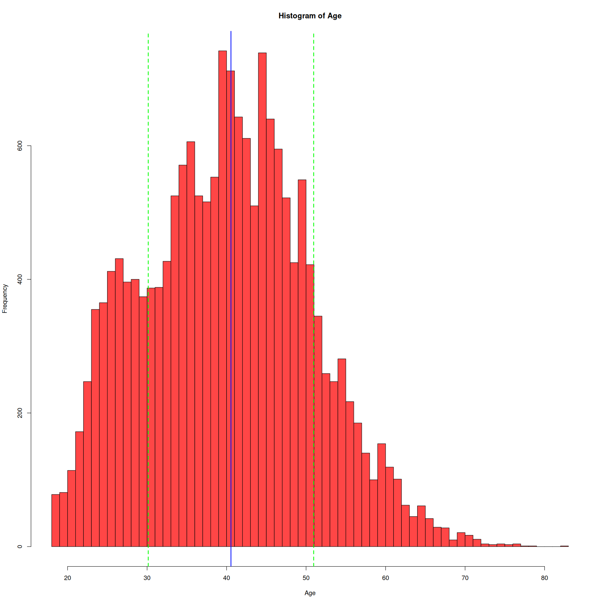

Podemos realizar un test de Shapiro-Wilk con una muestra de $30$ personas, el cual nos dirá si los datos provienen de una distribución normal.

```
Shapiro-Wilk normality test
data:  sample_data$age
W = 0.98149, p-value = 0.1735
```

El *p-value* tiene un valor menor de 0.05, por lo que la hipótesis nula no es rechazada. Luego, provienen de una distribución normal.

**2.2 ¿Si se escogen dos muestras de la población que tan posible es que su tiempo promedio sea el mismo?**

Para eso se puede usar el siguiente test:

```
Welch Two Sample t-test

data:  sample1$seconds and sample2$seconds
t = -3.4941, df = 1980.7, p-value = 0.0004862
alternative hypothesis: true difference in means is not equal to 0
95 percent confidence interval:
 -557.2778 -156.5942
sample estimate:
mean of x mean of y 
 13858.72  14215.66 
```

El p-value menor que 0.05 significa que en caso de ser cierta la hipótesis, la probabilidad de haber visto ese resultado es < 0.05.


**2.3 ¿Habrá alguna relación entre los corredores si los agrupamos por edad y género?**

Lo visualizamos: 

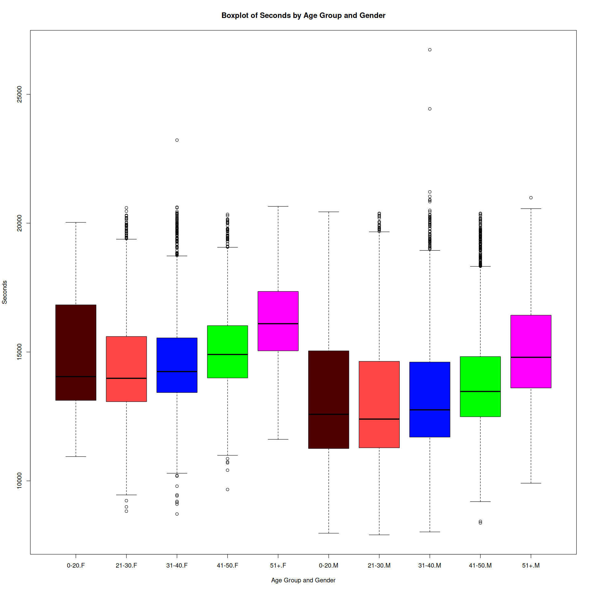

Creando grupos por edades y géneros podemos realizar un análisis de la varianza, pero dado que son muchos grupos conviene aplicarlo a cada par de estos. Como resultado se obtuvieron los siguientes intervalos de confianza representando la hipótesis de que hay asociación entre cada par.

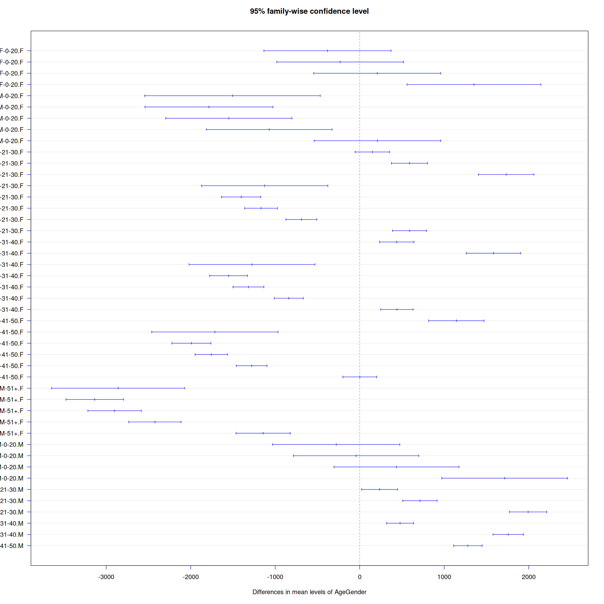

La longitud de un segmento representa el rango del intervalo de confianza para la diferencia entre las medias de dos grupos. Un segmento más largo indica menos certeza sobre la hipótesis que puede ser generado por una mayor desviación estándar o un menor tamaño de muestra en uno de los dos grupos. Si una línea cruza la línea vertical en $0$, eso significa que incluye a el $0$, o sea, no hay una diferencia estadísticamente significante entre la media de los grupos.

**2.4 ¿Habrá alguna relación entre los corredores si los agrupamos por edad y velocidad?**

Podemos visualizarlo:

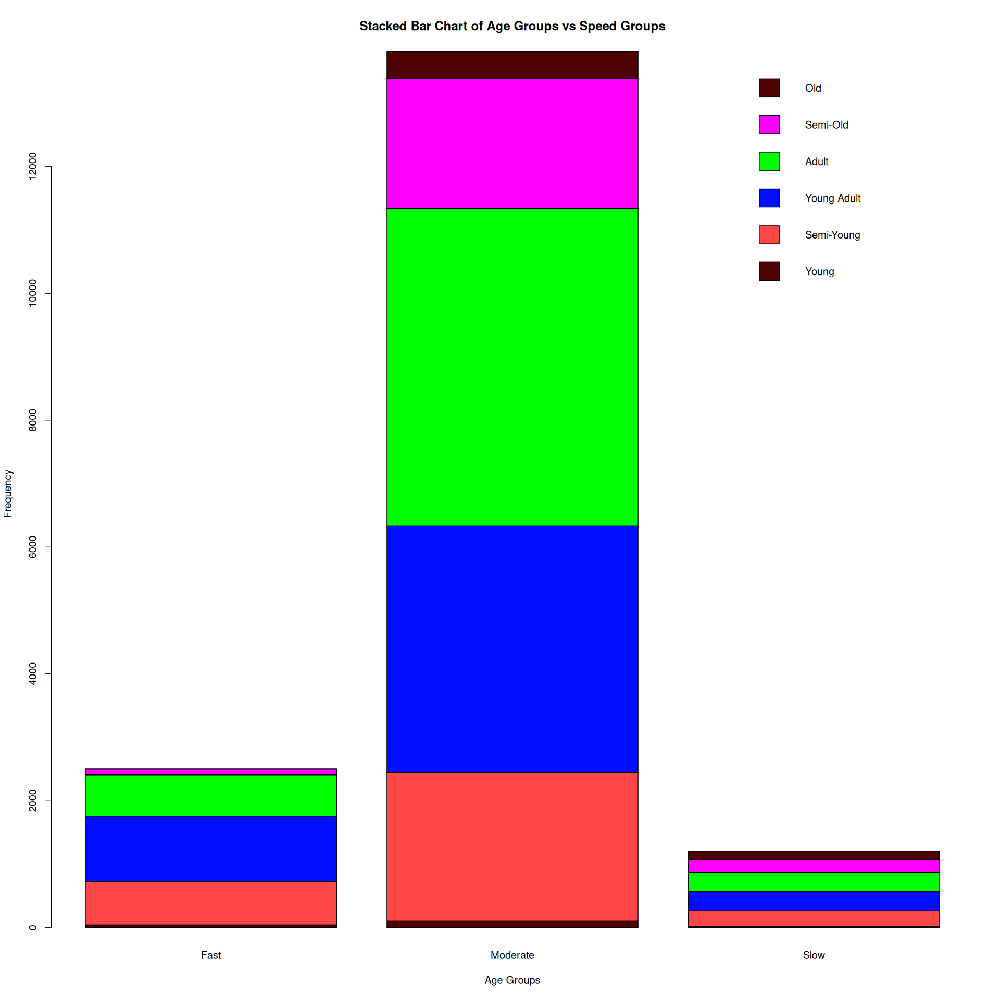
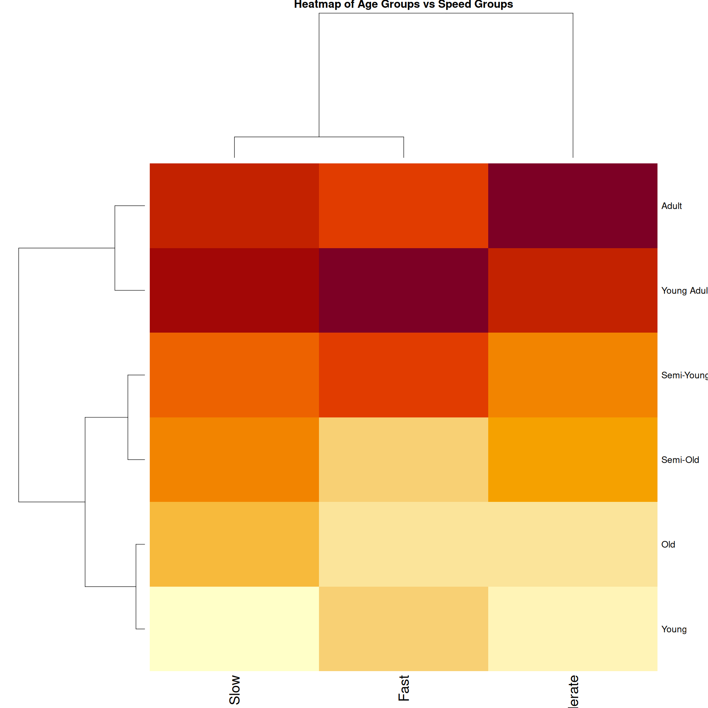

Para comprobar se puede usar el Chi-Square Test:

El Chi-square test es un test estadístico usado para determinar si hay una asociación entre variables categóricas en una muestra. Compara las frecuencias observadas con las esperadas, con qué tanta frecuencia una categoría ocurrirá si no hay asociación entre las variables.

El Chi-square funciona calculando una estadígrafo llamada la Chi-square estadígrafo, que sigue una distribución de este tipo cuando la hipótesis nula se cumple, que es que no hay asociación entre las variables.

```
             Fast Moderate Slow
  Young         37      103   19
  Semi-Young   687     2339  240
  Young Adult 1034     3895  311
  Adult        649     5001  296
  Semi-Old      91     2054  205
  Old            6      426  135

	Pearson's Chi-squared test

data:  contingency_table
X-squared = 892.8, df = 10, p-value < 2.2e-16
```
 
Dado que el p-value es prácticamente $0$, puedo concluir que hay asociación entre estos grupos de edades.

**2.5 ¿Si me demoro x segundos corriendo cómo estoy con respecto a los demás?**

Para esto es posible construir una distribución a partir de los valores obtenidos, para poder, dado un valor de segundos, obtener un porcentaje. Como se puede ver en la curva la mayor probabilidad o por ciento reside entre los $12000$ y $18000$ segundos, siendo muy baja la posibilidad de acabar antes de los $10000$ segundos.

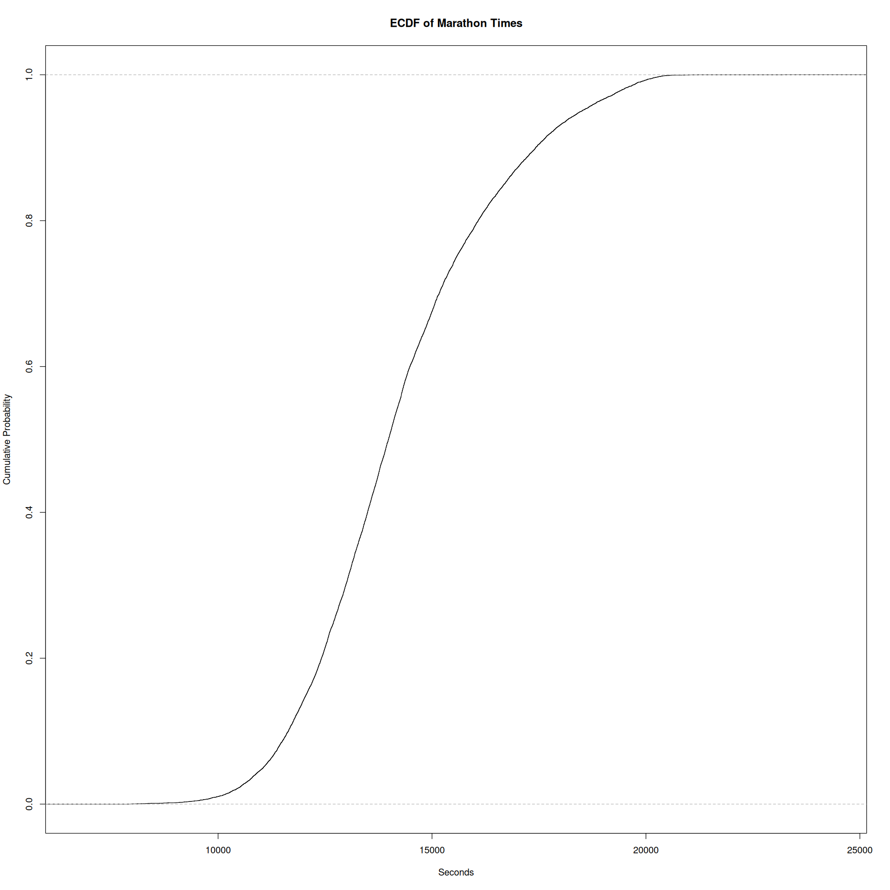

**2.6 ¿Se podrá predecir el género de las personas a partir de su edad y los segundos que le tomó la carrera?**

Los supuestos del modelo:

En el QQ-plot los valores de los datos, están ordenados de menor a mayor, en el eje $x$ estarían los puntos que tendría con un tamaño de muestra de igual dimensión, con una distribución normal, estandarizada. En el eje $y$ estarían mis datos estandarizados, si tuvieran una distribución normal, entonces deberían estar todos en la línea.

Un modelo linear de lo anterior posee el siguiente $QQ-Plot$ que como los valores no se apegan a la línea recta podemos ver que no será tan bueno en la predicción.


El R-Squared del modelo obtenido es $0.1525$. Es un valor bajo, lo que significa que el modelo no predecirá bien. el R-coeficiente-cuadrado mide la proporción de la varianza de la variable dependiente que es justificado por las variables independientes, o sea mientras más bajo menos eficiente es el modelo para predecir datos que varíen más con respecto a la media.

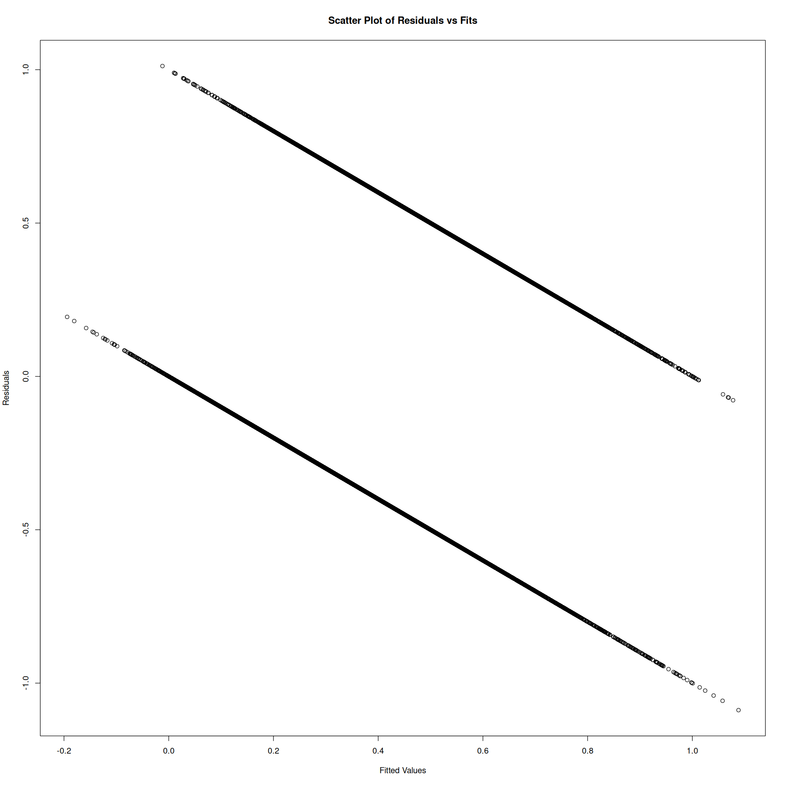

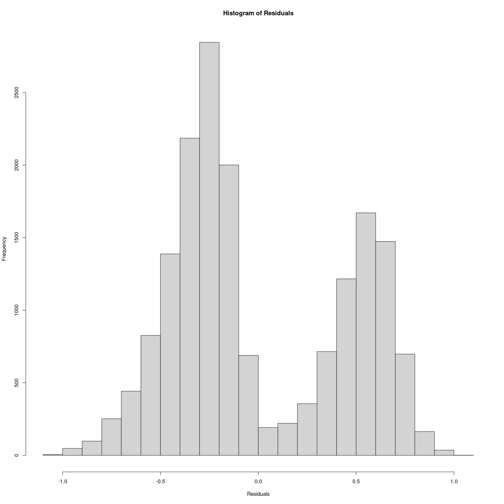

Como se puede visualizar en el histograma los residuos no siguen una distribución normal.

F-statistic:  1576 on 2 and 17523 DF. La estadística F se utiliza para probar la significancia general del modelo. Es una relación entre la varianza explicada y la varianza inexplicada. Un estadístico F más alto indica que el modelo explica una cantidad significativa de la varianza en la variable dependiente. El estadístico F se utiliza para realizar la prueba F, que prueba la hipótesis nula de que todos los coeficientes de regresión son iguales a cero. Si el valor p asociado con el estadístico F es menor que el nivel de significancia (generalmente 0,05), rechazamos la hipótesis nula y concluimos que al menos uno de los coeficientes es significativamente diferente de cero. A partir de esta se obtiene un p-value igual a 0.

También podemos visualizar que tan bien predice de esta forma:

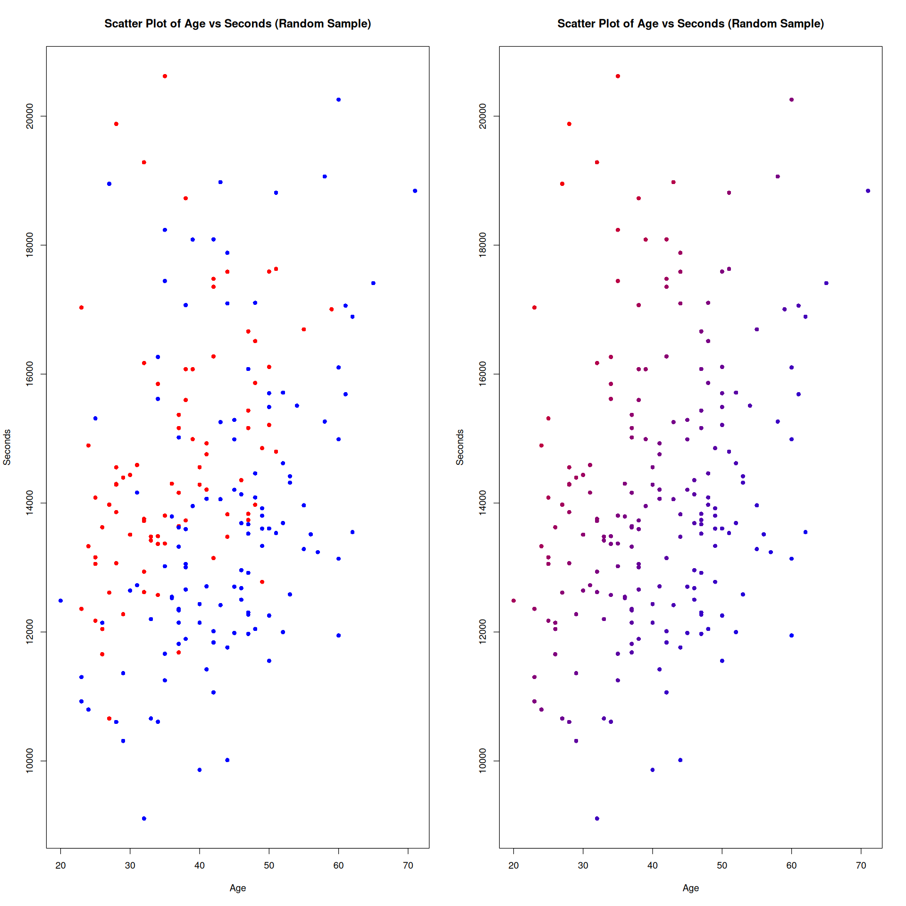


#### 3. Comparando ediciones

Para culminar, como un ejercicio estadístico, similar a problemas que surgen en la vida real; planteamos la siguiente pregunta:

- Suponiendo que los tiempos de carrera poseen una **distribución normal**, con **varianza conocida** (tomemos la varianza de la carrera de 2005); y que solo podemos seleccionar 50 tiempos de los resultados del 2015 de manera aleatoria (imaginemos que no podemos permitirnos pagar por más).
`¿Podríamos afirmar con estos datos que la carrera de 2015 fue en promedio más rápida que la del 2005?`


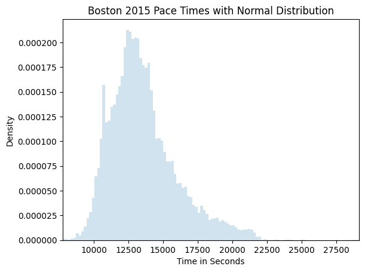

Las gráficas parecen indicar que sí ... vamos a ver.

**Solución**

Para responder dicha pregunta realizamos una prueba de hipótesis, utilizando el z-estadígrafo (normal) (dado que conocemos la varianza) tomando como hipótesis nula que el tiempo de carrera de 2015 fue en promedio tan o más lenta que la del 2005.

Los resultados:

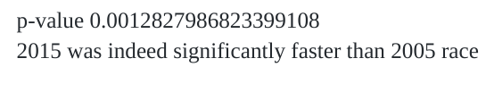

**Para hacer el problema aún más pragmático, agregamos la pregunta ¿y si desconociéramos la varianza?**

Como respuesta, realizamos un procedimiento muy similar a la prueba anterior, tomando en este caso al t-estadígrafo (t-student), en lugar del z-estadígrafo (normal).

Los resultados:

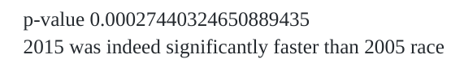


#### 4. Conclusiones

Dada la riqueza que ofrecieron los datos recopilados en las ediciones previas de la Maratón de Boston, fuimos capaces de realizar un profundo análisis estadístico de este evento: corroboramos la validez y comportamiento de los resultados, y a partir de estos nos planteamos una serie de preguntas que llevaron a modelos, hipótesis y respuestas que no siempre coincidían con lo que la intuición esperaba. Esto último es una característica fundamental de la estadística, demostrarnos que no siempre se cumple que todos los cisnes son blancos.