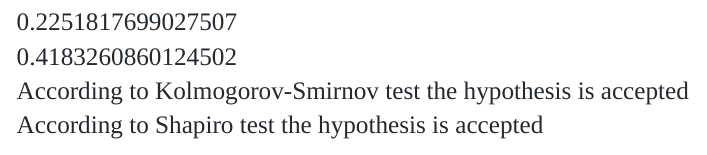
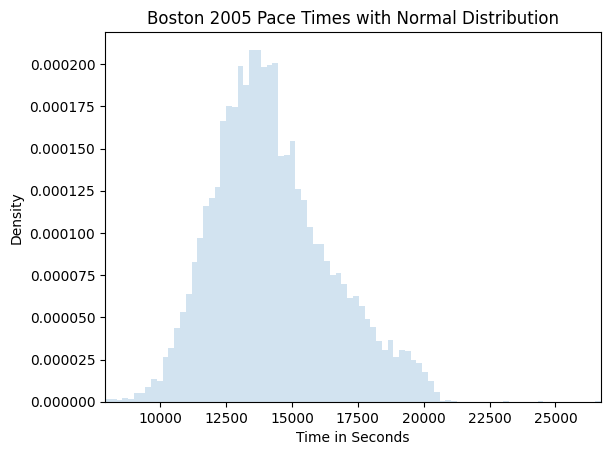

# Análisis Estadístico sobre la Maratón de Boston

## Datos utilizados

Dado el prestigio, tradición y participación (más de 25000 personas en 2015 y la cifra va en aumento) de la **Maratón de Boston** (Boston Marathon), decidimos realizar un análisis estadístico sobre los resultados de ediciones anteriores de este evento.

La fuente sobre la que nos apoyamos fue el [Boston Marathon Data Project](https://github.com/adrian3/Boston-Marathon-Data-Project) un repositorio de Github que alberga los resultados de la maratón desde 1897 hasta 2019.

Los datos se encuentran en formato **csv** y ofrecen las siguientes variables:

- `display_name`
- `age`
- `gender`
- `residence`
- `pace`
- `official_time`
- `overall`
- `gender_result`
- `division_result`
- `seconds`
- `first_name`
- `last_name`

Vale recalcar que, de 2015 en adelante fueron añadidos:

- `bib`
- `city`
- `state`
- `5k` 
- `10k`
- `15k`
- `20k`
- `half`
- `25k`
- `30k`
- `35k`
- `40k`

Por motivos pragmáticos decidimos trabajar solamente sobre los datos recopilados en los eventos de **2005**, **2010** y **2015**.

### Informe

La primera pregunta estadística que nos viene a la mente cuando hablamos de competiciones (incluso antes de realizar un análisis exploratorio) es: ¿cómo se comportaron los resultados?, o mejor formulado: ¿qué distribución poseen?

El histograma describe una distribución que se asemeja a una **normal**; lo que nos lleva directamente a plantear y comprobar la hipótesis: `los resultados de la maratón de 2015 tienen una distribución normal`.

Utilizando los tests de **Kolmogorov-Smirnov** y **Shapiro** sobre `muestras aleatorias de 100 y 30 personas` respectivamente obtuvimos los siguientes resultados 

#### 1. Análisis Exploratorio de los Datos

**Dispersión de Lugar vs País de Residencia**

Como podemos observar, los resultados obtenidos en la gráfica coinciden con lo que nos indica el sentido común: países como Etiopía y Kenya obtuvieron lugares muy cercanos al podio, sin embargo, tuvieron una escasa participación en el evento (dado los bajos recursos económicos de sus habitantes), mientras que países como USA, Italia, Francia, UK y Australia sí tuvieron una asistencia prominente (dado que son potencias económicas).

**Dispersión de Lugar vs Edad**

Como en la dispersión anterior, el sentido común nos hubiera ayudado a predecir el resultado obtenido en esta gráfica: las personas relativamente jóvenes (entre 20 y 45 años) ocupan la mayoría de las posiciones cercanas al podio y representan el grueso de la participación; mientras que los mayores de 50 ocupan lugares alejados de la cabecera y su densidad es mucho menor.

**Matriz de Correlación**

Podemos extraer dos conclusiones importantes de la matriz de correlaciones obtenida. La primera es que el tiempo obtenido durante los primeros 5km no es tan buen predictor del resultado global como el tiempo de los primeros 10km, y la explicación detrás de esto se encuentra en que muchos corredores inexpertos se lanzan, impulsados por el ánimo, ansiedad y ambición, a correr demasiado rápido al comienzo de la carrera, llevándolos a una fatiga que termina en peores resultados globales.

La segunda conclusión es que existe una correlación positiva débil entre la edad y el tiempo total; un resultado un poco contradictorio con lo que nos dicta la intuición, pensaríamos que la correlación es positiva fuerte. La explicación, se encuentra en la biología, a medida que envejecemos las fibras musculares rápidas, encargadas de movimientos de fuerza y potencia, se pierden con mayor rapidez que las fibras lentas, útiles para ejercicios de resistencia como correr; Eliud Kipchoge es el vivo ejemplo, cuando con 40 años fue capaz de bajar de las 2 horas en la maratón (se pensaba que era una marca imposible de conseguir).

#### 2. Comparando ediciones

Como un ejercicio estadístico, similar a problemas que surgen en la vida real; planteamos la siguiente pregunta:

- Suponiendo que los tiempos de carrera poseen una **distribución normal**, con **varianza conocida** (tomemos la varianza de la carrera de 2005); y que solo podemos seleccionar 50 tiempos de los resultados del 2015 de manera aleatoria (imaginemos que no podemos permitirnos pagar por más).
`¿Podríamos afirmar con estos datos que la carrera de 2015 fue en promedio más rápida que la del 2005?`

Las gráficas parecen indicar que sí ... vamos a ver.

**Solución**

Para responder dicha pregunta realizamos una prueba de hipótesis, utilizando el z-estadígrafo (normal) (dado que conocemos la varianza) tomando como hipótesis nula que el tiempo de carrera de 2015 fue en promedio tan o más lenta que la del 2005.

Los resultados:

**Para hacer el problema aún más pragmático, agregamos la pregunta ¿y si desconociéramos la varianza?**

Como respuesta, realizamos un procedimiento muy similar a la prueba anterior, tomando en este caso al t-estadígrafo (t-student), en lugar del z-estadígrafo (normal).

Los resultados:

